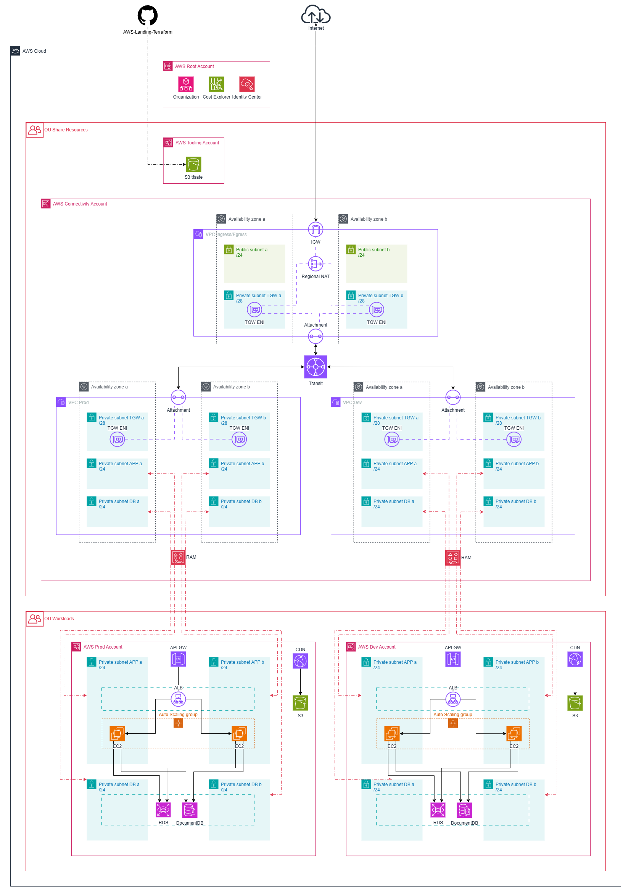

# AWS Landing Zone — Terraform


Implementación de una AWS Landing Zone multicuenta con Terraform. Arquitectura hub-spoke diseñada para entornos productivos con segmentación por función, networking centralizado y despliegue automatizado vía CI/CD con OIDC y cross-account role assumption.

---

## Arquitectura



### Cuentas y Organizational Units

| Cuenta | OU | Propósito |
|--------|-----|-----------|
| **Root** | — | AWS Organizations, Identity Center (SSO), Cost Explorer |
| **Tooling** | Share Resources | Remote state de Terraform (S3 con versionado, cifrado y locking nativo), rol OIDC base |
| **Connectivity** | Share Resources | Networking centralizado: VPC hub + VPCs spoke, Transit Gateway, Internet Gateway, NAT Gateway, AWS RAM |
| **Workloads Dev** | Workloads | Cargas de trabajo del entorno dev en subnets compartidas por RAM |
| **Workloads Prod** | Workloads | Cargas de trabajo del entorno prod en subnets compartidas por RAM |

### Networking — Hub-Spoke

Modelo hub-spoke donde la cuenta **Connectivity** gestiona TODO el networking (hub + spokes) y comparte subnets a **Workloads** via AWS RAM.

**Hub — Connectivity Account** (desplegado en `us-east-1a`, `us-east-1b`):

- **VPC IngresEgress (hub)**: subnets públicas con Internet Gateway, subnets privadas TGW para los ENIs del Transit Gateway.
- **VPCs Spoke**: creadas dinámicamente a partir de `var.spoke_vpcs` usando `merge()` con el hub. Un spoke por entorno (dev, prod, etc.) — sin workspaces, solo `for_each`.
- **Transit Gateway**: punto central de la topología hub-spoke. Todos los spokes se conectan via attachments.
- **Internet Gateway**: salida directa a internet para las subnets públicas del hub.
- **NAT Gateway** (regional, EIPs automáticas): salida a internet para tráfico proveniente de los spokes (TGW subnets → NAT → Internet). Modo regional — crea ENIs en cada AZ con asignación automática de Elastic IPs.
- **AWS RAM**: un resource share por spoke (`dev-subnets`, `prod-subnets`), cada uno compartido solo a su cuenta Workloads correspondiente. Las subnets TGW NO se comparten (son infraestructura de networking). Las keys de `spoke_vpcs` deben coincidir con las keys de `workloads_account_ids`.

**Routing del Hub**:

| Route Table | Destino | Siguiente salto |
|-------------|---------|-----------------|
| Public subnets | `0.0.0.0/0` | Internet Gateway |
| Public subnets | CIDRs de cada spoke | Transit Gateway |
| TGW subnets | `0.0.0.0/0` | NAT Gateway |
| Main (default) | CIDRs de cada spoke | Transit Gateway |

Las rutas hacia los spokes se generan dinámicamente — los CIDRs se derivan de `var.spoke_vpcs` (no requiere variable separada). La main route table (creada automáticamente por AWS) es utilizada por los ENIs internos del NAT Gateway regional para enrutar el tráfico de retorno hacia los spokes.

**Routing del Transit Gateway**:

| Destino | Siguiente salto |
|---------|-----------------|
| `0.0.0.0/0` | Attachment de IngresEgress |

Ruta default estática que dirige todo el tráfico de los spokes hacia el hub para salida a internet via NAT Gateway.

**Routing de los Spokes** (creado en Connectivity):

| Route Table | Destino | Siguiente salto |
|-------------|---------|-----------------|
| App/DB subnets | `0.0.0.0/0` | Transit Gateway |
| TGW subnets | — | Sin ruta default (subnets de attachment, evita loop circular) |

**Workloads Account**:

- Dev y prod son cuentas AWS separadas dentro de la misma OU (Workloads).
- NO crean VPCs, subnets, TGW attachments ni rutas — todo vive en Connectivity.
- Consumen subnets compartidas via RAM, leyendo IDs desde `terraform_remote_state`.
- Cada cuenta usa workspaces para seleccionar qué spoke le corresponde y desplegar compute en sus subnets.
- Convención de naming para subnets: `{tipo}-{sufijo}` (ej: `app-a`, `db-b`, `tgw-a`). El prefijo antes del primer guión determina el tipo y agrupa subnets en la misma route table.

**Flujo de tráfico spoke → internet**: Spoke (app/db subnet) → TGW → Hub (TGW subnet) → NAT Gateway → Internet Gateway → Internet.

### Compute y Aplicación (Workloads Account)

```
Internet → CloudFront (CDN) → S3 (estáticos)
Internet → API Gateway → ALB → Auto Scaling Group (EC2) → RDS / DocumentDB
```

### CI/CD — Cross-Account OIDC

```
GitHub Actions → OIDC → Rol base (Tooling) → AssumeRole → Rol destino (Connectivity/Workloads)
```

Pipeline con `workflow_dispatch`:
- Selección de cuenta (`connectivity` | `workloads`)
- Selección de acción (`plan` | `apply` | `destroy` | `unlock`)
- Selección de entorno (`dev` | `prod`) para workloads
- Resolución automática del rol de despliegue y variables de red por cuenta/entorno

**Roles cross-account requeridos**:

| Rol | Cuenta | Propósito |
|-----|--------|-----------|
| OIDC base | Tooling | GitHub Actions lo asume via OIDC. Desde aquí se asumen los roles destino |
| Deploy Connectivity | Connectivity | Despliega VPCs, TGW, gateways, rutas, RAM |
| Deploy Workloads Dev | Workloads Dev | Despliega compute en subnets compartidas (dev) |
| Deploy Workloads Prod | Workloads Prod | Despliega compute en subnets compartidas (prod) |

Cada cuenta destino necesita su propio rol de despliegue que el rol OIDC base (Tooling) pueda asumir. Esto requiere:

1. **En cada cuenta destino** (Connectivity, Workloads Dev, Workloads Prod): crear un rol IAM con los permisos necesarios para desplegar recursos.

2. **Trust relationship** del rol destino — debe permitir que el rol OIDC de Tooling lo asuma:

```json
{
  "Version": "2012-10-17",
  "Statement": [
    {
      "Effect": "Allow",
      "Principal": {
        "AWS": "arn:aws:iam::<TOOLING_ACCOUNT_ID>:role/<OIDC_ROLE_NAME>"
      },
      "Action": "sts:AssumeRole"
    }
  ]
}
```

3. **Policy en el rol OIDC de Tooling** — debe tener permiso para asumir los roles destino:

```json
{
  "Effect": "Allow",
  "Action": "sts:AssumeRole",
  "Resource": [
    "arn:aws:iam::<CONNECTIVITY_ACCOUNT_ID>:role/<DEPLOY_ROLE_NAME>",
    "arn:aws:iam::<WORKLOADS_DEV_ACCOUNT_ID>:role/<DEPLOY_ROLE_NAME>",
    "arn:aws:iam::<WORKLOADS_PROD_ACCOUNT_ID>:role/<DEPLOY_ROLE_NAME>"
  ]
}
```

Sin estos roles y trust relationships, Terraform opera en la cuenta Tooling (donde aterriza el OIDC) en vez de la cuenta destino.

**Secrets requeridos**:

| Secret | Propósito |
|--------|-----------|
| `AWS_ROLE_ARN` | Rol OIDC base en la cuenta Tooling |
| `ROLE_ARN_CONNECTIVITY` | Rol de despliegue en Connectivity |
| `ROLE_ARN_WORKLOADS_DEV` | Rol de despliegue en Workloads (dev) |
| `ROLE_ARN_WORKLOADS_PROD` | Rol de despliegue en Workloads (prod) |
| `S3_STATE` | Nombre del bucket S3 para remote state |
| `WORKLOADS_ACCOUNT_IDS` | JSON `map(string)` con IDs de las cuentas Workloads para AWS RAM |

**Variables de repositorio** (GitHub Settings → Variables):

| Variable | Formato | Propósito |
|----------|---------|-----------|
| `IN_OUT_CIDR` | JSON `object` | VPC del hub: CIDR + subnets (pasado como `TF_VAR_cidr_ingress_egress`) |
| `SPOKE_VPCS` | JSON `map(object)` | VPCs spoke con subnets: CIDR + mapa de subnets por entorno (pasado como `TF_VAR_spoke_vpcs`) |

Las variables de red no tienen valores default en Terraform — los valores se gestionan exclusivamente desde GitHub para mantener una fuente de verdad única. El pipeline inyecta condicionalmente las variables según la cuenta seleccionada (connectivity recibe `IN_OUT_CIDR` + `SPOKE_VPCS` + `WORKLOADS_ACCOUNT_IDS`, workloads solo recibe el rol de despliegue).

### State Management

```
Tooling Account → S3 Bucket (versionado + cifrado AES256 + locking nativo + public access block)
```

Script de bootstrap (`stateUtil.sh`) para crear el bucket con backend local y migrar el state a S3 automáticamente.

---

## Stack

| Capa | Herramienta |
|------|-------------|
| **IaC** | Terraform 1.15 con módulos reutilizables por dominio |
| **CI/CD** | GitHub Actions con OIDC + cross-account role assumption |
| **State** | S3 backend en cuenta Tooling (versionado + locking nativo) |
| **Entornos** | Terraform workspaces (dev/prod) en cuenta Workloads |
| **Acceso** | AWS Identity Center (SSO) para acceso por CLI |
| **Región** | `us-east-1` |

---

## Estructura de carpetas

```
.
├── .github/workflows/
│   └── deploy.yml                  # Pipeline CI/CD con OIDC + cross-account
├── diagrams/
│   ├── arquitectura.drawio         # Fuente editable del diagrama
│   └── arquitectura.png            # Diagrama exportado
├── accounts/
│   ├── tooling/
│   │   ├── provider.tf
│   │   ├── main.tf                 # S3 state bucket (versionado, cifrado, locking)
│   │   ├── variables.tf
│   │   ├── outputs.tf
│   │   ├── stateUtil.sh            # Bootstrap/destroy del state remoto
│   │   └── terraform.example.tfvars
│   ├── connectivity/
│   │   ├── provider.tf             # assume_role cross-account
│   │   ├── backend.tf
│   │   ├── main.tf                 # VPC hub + VPCs spoke + TGW + IGW + NAT GW + rutas + RAM
│   │   ├── variables.tf            # cidr_ingress_egress + spoke_vpcs + workloads_account_id
│   │   └── outputs.tf              # Exporta transit_id, spoke VPC/subnet/route table IDs
│   └── workloads/
│       ├── provider.tf             # assume_role cross-account, workspace tags
│       ├── backend.tf
│       ├── main.tf                 # Remote state connectivity → consume subnets compartidas via RAM
│       ├── variables.tf            # Variables comunes (sin networking)
│       └── outputs.tf              # VPC ID y subnet IDs del workspace activo
└── modules/
    ├── networking/
    │   ├── vpc/                    # VPC + Subnets (for_each, multi-VPC, TGW attachment output)
    │   └── transit-gateway/        # TGW VPC attachments (for_each sobre mapa de VPCs)
    ├── compute/
    │   ├── ec2/
    │   ├── asg/
    │   └── alb/
    ├── database/
    │   ├── rds/
    │   └── documentdb/
    └── storage/
        ├── s3/                     # Bucket con versionado, cifrado, public access block
        └── cdn/                    # CloudFront distribution
```

---

## Decisiones de diseño

**¿Por qué una cuenta de Connectivity separada?**  
Centralizar el networking en una cuenta dedicada permite controlar todo el tráfico de entrada/salida desde un único punto, simplifica el firewall perimetral y facilita la auditoría de flujos de red sin tocar las cuentas de aplicación.

**¿Por qué Transit Gateway en vez de VPC Peering?**  
Transit Gateway escala a N VPCs sin relaciones de peering punto a punto. Al agregar nuevas cuentas o VPCs al entorno, solo se requiere un attachment al TGW existente, sin modificar route tables en cada VPC.

**¿Por qué todas las VPCs viven en Connectivity y no en Workloads?**  
Centralizar hub Y spokes en una sola cuenta permite gestionar todo el networking desde un único punto: VPCs, subnets, TGW attachments, rutas y RAM shares. Workloads solo consume subnets compartidas y despliega compute — no necesita permisos de networking. Agregar un nuevo spoke es agregar una entrada al mapa `spoke_vpcs` y hacer apply en connectivity.

**¿Por qué AWS RAM en vez de crear subnets en cada cuenta?**  
RAM permite compartir subnets existentes sin duplicar infraestructura de red. Las subnets se crean una vez en Connectivity y se comparten a las cuentas de Workloads (dev y prod). Los recursos desplegados en cada cuenta (EC2, ALB, RDS) aparecen en las subnets compartidas sin que Workloads tenga que gestionar VPCs ni rutas. Solo se comparten subnets de app/db — las subnets TGW son infraestructura de networking y no se comparten. Cada spoke tiene su propio resource share asociado únicamente a su cuenta Workloads correspondiente, garantizando que cada cuenta solo ve sus propias subnets.

**¿Por qué las variables de red viven en GitHub y no en Terraform?**  
Los defaults hardcodeados en `variables.tf` generan duplicación. Centralizar los valores en GitHub repo variables crea una fuente de verdad única. El pipeline inyecta condicionalmente solo las variables que cada cuenta necesita — connectivity recibe la configuración de red completa (`IN_OUT_CIDR` + `SPOKE_VPCS`), workloads solo recibe el rol de despliegue.

**¿Por qué NAT Gateway regional y no uno por AZ?**  
El modo regional crea ENIs automáticamente en cada AZ con asignación automática de Elastic IPs — sin necesidad de gestionar EIPs ni seleccionar subnets manualmente. Los ENIs internos del NAT regional usan la default route table del VPC (la que AWS crea automáticamente), por lo que es necesario agregar rutas `spoke CIDRs → TGW` en esa route table para que el tráfico de retorno (internet → NAT → de-NAT → spoke) llegue correctamente al Transit Gateway. Las Elastic IPs pueden tardar en aprovisionarse en todas las AZs al crear el NAT — esto es normal y no requiere intervención.

**¿Por qué las subnets TGW no tienen ruta default al Transit Gateway?**  
Las subnets TGW son los puntos de attachment — el tráfico entra a la VPC por ellas desde el Transit Gateway. Agregar una ruta `0.0.0.0/0 → TGW` en su route table crearía un loop circular: el tráfico llegaría desde el TGW, la route table lo enviaría de vuelta al TGW, y así indefinidamente.

**¿Por qué Terraform workspaces para entornos?**  
En Workloads, los workspaces seleccionan qué spoke consumir (dev/prod). En Connectivity, los spokes se crean dinámicamente via `for_each` sobre `var.spoke_vpcs` — sin workspaces, todos los spokes coexisten en un solo state. Workloads usa workspaces para filtrar los subnet IDs del spoke correspondiente al entorno.

**¿Por qué cross-account role assumption?**  
Un único rol OIDC en la cuenta Tooling asume roles de despliegue en cada cuenta destino. Cada cuenta tiene su propio rol con permisos acotados a lo que necesita. El pipeline resuelve el rol correcto automáticamente según la cuenta y el entorno seleccionados.

**¿Por qué OIDC en lugar de access keys en CI/CD?**  
Las credenciales de larga duración son el vector de compromiso más común en pipelines. OIDC emite tokens temporales con el scope mínimo necesario para cada ejecución — sin secrets que rotar ni credenciales que filtrar.

**¿Por qué S3 locking nativo en lugar de DynamoDB?**  
Terraform 1.10+ soporta locking nativo en S3 (`use_lockfile = true`), eliminando la necesidad de una tabla DynamoDB adicional. Menos infraestructura, mismo resultado.

---

## Uso

### Prerrequisitos

- Terraform >= 1.10
- AWS CLI v2 configurado con Identity Center (SSO)
- AWS Organizations habilitado con las OUs creadas
- Rol OIDC configurado para GitHub Actions
- Roles de despliegue cross-account creados en cada cuenta destino

### Bootstrap del state remoto

```bash
cd accounts/tooling
cp terraform.example.tfvars terraform.tfvars  # Editar con valores reales
./stateUtil.sh bootstrap <aws-profile>
```

Esto crea el bucket S3, migra el state de local a remoto y genera el `config.hcl` con la configuración del backend.

### Despliegue via CI/CD

Desde GitHub → Actions → **Deploy Terraform - OIDC**:
1. Seleccionar cuenta (`connectivity` | `workloads`)
2. Seleccionar acción (`plan` | `apply` | `destroy`)
3. Seleccionar entorno (`dev` | `prod`) si la cuenta es workloads
4. Ejecutar workflow

El pipeline resuelve automáticamente el rol de despliegue cross-account.

### Despliegue local

```bash
cd accounts/connectivity
terraform init \
  -backend-config="bucket=<nombre-bucket>" \
  -backend-config="key=accounts/connectivity/terraform.tfstate" \
  -backend-config="region=us-east-1"
terraform plan
```

---

## Estado del proyecto

### Implementado

- [x] Diseño de arquitectura multicuenta hub-spoke (3 cuentas, 2 OUs)
- [x] Remote state en cuenta Tooling (S3 + versionado + cifrado + locking nativo)
- [x] Script de bootstrap/destroy para state remoto
- [x] Pipeline CI/CD con OIDC y cross-account role assumption
- [x] Resolución automática de rol y variables de red por cuenta/entorno en el pipeline
- [x] Variables de red externalizadas a GitHub repo variables (sin defaults en Terraform)
- [x] Módulo VPC con soporte multi-VPC, subnets dinámicas y output de TGW attachments
- [x] Módulo Transit Gateway (attachments reutilizable con for_each)
- [x] Módulo S3 reutilizable (versionado, cifrado, public access block)
- [x] Cuenta Connectivity: VPC hub + VPCs spoke (dinámicas via merge + for_each)
- [x] Cuenta Connectivity: Transit Gateway + Internet Gateway + NAT Gateway
- [x] Cuenta Connectivity: route tables con rutas dinámicas hub↔spokes
- [x] Cuenta Connectivity: AWS RAM para compartir subnets app/db a Workloads
- [x] Cuenta Workloads: consume subnets compartidas via remote state + RAM
- [x] Terraform workspaces para separación de entornos (dev/prod)

### Pendiente

- [ ] Módulo CloudFront (CDN)
- [ ] Módulos de compute (EC2, ASG, ALB)
- [ ] Módulos de base de datos (RDS, DocumentDB)
---

> **Nota sobre testing:** AWS Organizations desactiva el free tier de las cuentas miembro. Debido a la limitación de créditos, solo se realizaron pruebas funcionales sobre la capa de networking (VPCs, Transit Gateway, routing). Los módulos de compute (EC2, ASG, ALB) y base de datos (RDS, DocumentDB) están definidos en el código pero no han sido desplegados ni validados en un entorno real.

---

## Ejemplo de variables de GitHub

### `IN_OUT_CIDR` (variable)

VPC hub con subnets públicas y TGW. Pasado como `TF_VAR_cidr_ingress_egress`.

```json
{
  "cidr_block": "10.0.0.0/16",
  "subnets": {
    "public-a1": { "cidr_block": "10.0.1.0/24", "az": "us-east-1a" },
    "public-b1": { "cidr_block": "10.0.2.0/24", "az": "us-east-1b" },
    "tgw-a1":    { "cidr_block": "10.0.10.0/24", "az": "us-east-1a" },
    "tgw-b1":    { "cidr_block": "10.0.11.0/24", "az": "us-east-1b" }
  }
}
```

### `SPOKE_VPCS` (variable)

VPCs spoke por entorno. Cada entrada crea una VPC con sus subnets, TGW attachment y rutas. Pasado como `TF_VAR_spoke_vpcs`.

```json
{
  "dev": {
    "cidr_block": "10.1.0.0/16",
    "subnets": {
      "app-a1": { "cidr_block": "10.1.1.0/24", "az": "us-east-1a" },
      "app-b1": { "cidr_block": "10.1.2.0/24", "az": "us-east-1b" },
      "db-a1":  { "cidr_block": "10.1.3.0/24", "az": "us-east-1a" },
      "db-b1":  { "cidr_block": "10.1.4.0/24", "az": "us-east-1b" },
      "tgw-a1": { "cidr_block": "10.1.10.0/24", "az": "us-east-1a" },
      "tgw-b1": { "cidr_block": "10.1.11.0/24", "az": "us-east-1b" }
    }
  },
  "prod": {
    "cidr_block": "10.2.0.0/16",
    "subnets": {
      "app-a1": { "cidr_block": "10.2.1.0/24", "az": "us-east-1a" },
      "app-b1": { "cidr_block": "10.2.2.0/24", "az": "us-east-1b" },
      "db-a1":  { "cidr_block": "10.2.3.0/24", "az": "us-east-1a" },
      "db-b1":  { "cidr_block": "10.2.4.0/24", "az": "us-east-1b" },
      "tgw-a1": { "cidr_block": "10.2.10.0/24", "az": "us-east-1a" },
      "tgw-b1": { "cidr_block": "10.2.11.0/24", "az": "us-east-1b" }
    }
  }
}
```

> **Convención de naming**: el prefijo antes del primer guión (`app`, `db`, `tgw`) determina el tipo de subnet y agrupa subnets en la misma route table. Las subnets `tgw` son de attachment al Transit Gateway y NO se comparten via RAM. Las subnets `app` y `db` se comparten a Workloads.

### `AWS_ROLE_ARN` (secret)

ARN del rol OIDC base en la cuenta Tooling. GitHub Actions lo asume para obtener credenciales temporales.

```
arn:aws:iam::111111111111:role/github-oidc-role
```

### `ROLE_ARN_CONNECTIVITY` (secret)

ARN del rol de despliegue en la cuenta Connectivity. El rol OIDC base lo asume via `sts:AssumeRole`.

```
arn:aws:iam::222222222222:role/terraform-deploy
```

### `ROLE_ARN_WORKLOADS_DEV` (secret)

ARN del rol de despliegue en la cuenta Workloads Dev.

```
arn:aws:iam::333333333333:role/terraform-deploy
```

### `ROLE_ARN_WORKLOADS_PROD` (secret)

ARN del rol de despliegue en la cuenta Workloads Prod.

```
arn:aws:iam::444444444444:role/terraform-deploy
```

### `S3_STATE` (secret)

Nombre del bucket S3 en la cuenta Tooling donde se almacena el remote state.

```
my-project-terraform-state
```

### `WORKLOADS_ACCOUNT_IDS` (secret)

IDs de las cuentas de Workloads para la asociación de principal en AWS RAM. Las keys deben coincidir con las de `SPOKE_VPCS`.

```json
{ "dev": "333333333333", "prod": "444444444444" }
```
